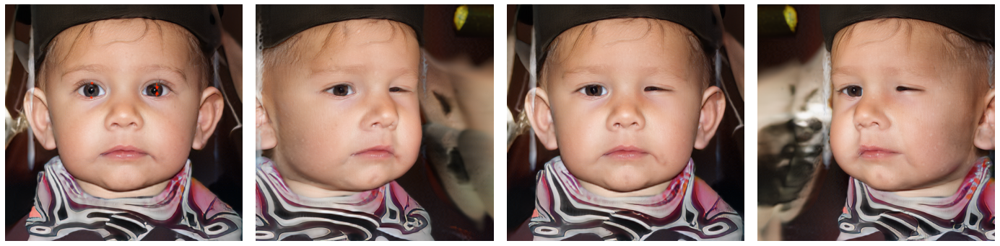
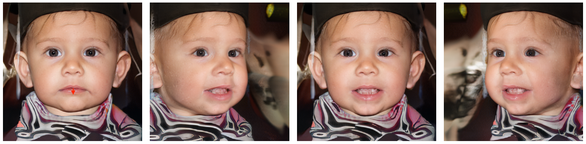
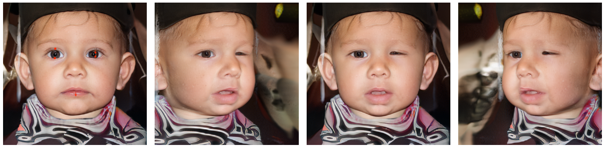

# DragGAN-3D
A combination of `Drag Your GAN: Interactive Point-based Manipulation on the Generative Image Manifold` and `Efficient Geometry-aware 3D Generative Adversarial Networks`.

## Usage

Basically everything is in `core/model.py`, the whole thing is just a script.

> python core/model.py

## Disclaimer

> This project was conducted as a curricular project and I'm not going to actively maintain the repo, but I'll be happy to answer in case there is any question. Feel free to open issues.

## Examples

## References

You will be able to find referred repo using `git submodule` and get their upstream forks.

## License

See `LICENSE`.